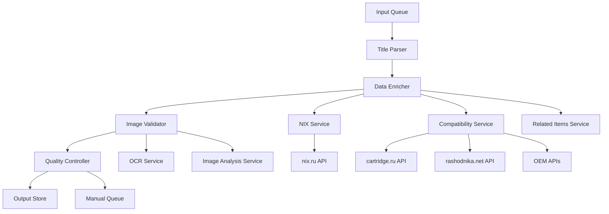

# Design Document: Consumable Enricher

## Overview

The Consumable Enricher is a data processing system that transforms supplier product titles into structured, enriched consumable cards for printing supplies. The system follows an ETL (Extract, Transform, Load) architecture pattern with specialized components for parsing, enrichment, validation, and quality control.

The system processes items through a pipeline: Input → Parse → Enrich → Validate → Output, with comprehensive error handling and manual review queues for items requiring human intervention.

## Architecture

The system uses a modular, service-oriented architecture with clear separation of concerns:



### Core Components

- **Pipeline Controller**: Orchestrates the entire enrichment process
- **Title Parser**: Extracts structured data from supplier titles
- **Data Enricher**: Fetches additional data from external sources
- **Image Validator**: Validates product images against quality criteria
- **Quality Controller**: Determines publication readiness and routing
- **Manual Queue Manager**: Handles items requiring human review

### External Services

- **NIX Service**: Fetches package dimensions and weight from nix.ru
- **Compatibility Service**: Aggregates printer compatibility from multiple sources
- **Related Items Service**: Finds related consumables for the same printers
- **OCR Service**: Extracts text from images for validation
- **Image Analysis Service**: Analyzes image content and quality

## Components and Interfaces

### Title Parser

**Purpose**: Extract structured information from supplier product titles

**Input Interface**:
```typescript
interface ParseRequest {
  supplier_title: string;
  supplier_sku?: string;
  supplier_brand?: string;
  source_ref?: string;
}
```

**Output Interface**:
```typescript
interface ParseResult {
  consumable_model_main: string;
  consumable_model_candidates: string[];
  consumable_type: ConsumableType;
  printer_brand: string;
  consumable_color?: string;
  yield_value?: number;
  yield_unit?: 'pages' | 'copies';
  has_chip?: boolean;
  has_page_counter?: boolean;
  printer_models_from_title: string[];
  title_norm: string;
  supplier_title_raw: string;
}
```

**Key Methods**:
- `normalizeTitle(title: string): string` - Unicode normalization and cleanup
- `extractModel(title: string): ModelExtractionResult` - Extract consumable model
- `determineBrand(title: string, model: string): string` - Identify printer brand
- `classifyType(title: string, model: string): ConsumableType` - Classify consumable type
- `extractCompatibility(title: string): string[]` - Extract printer models from title

### Data Enricher

**Purpose**: Enrich parsed data with information from external sources

**Input Interface**:
```typescript
interface EnrichmentRequest {
  parseResult: ParseResult;
  enrichmentConfig: EnrichmentConfig;
}
```

**Output Interface**:
```typescript
interface EnrichmentResult {
  model_alias_short?: string;
  package_dimensions_mm: Dimensions;
  package_weight_g: number;
  compatible_printers_all: PrinterCompatibility[];
  compatible_printers_ru: PrinterCompatibility[];
  compatible_printers_unverified: PrinterCompatibility[];
  related_consumables_full: RelatedConsumable[];
  related_consumables_display: RelatedConsumable[];
  sources: DataSource[];
  enrichment_status: 'complete' | 'partial' | 'failed';
  enrichment_errors: string[];
}
```

**Key Methods**:
- `enrichModelAlias(model: string): Promise<string | null>` - Find model aliases
- `fetchPackageDimensions(model: string, brand: string): Promise<PackageInfo>` - Get dimensions from NIX
- `aggregateCompatibility(model: string, brand: string): Promise<PrinterCompatibility[]>` - Merge compatibility data
- `filterRussianMarket(printers: PrinterCompatibility[]): PrinterCompatibility[]` - Apply RU market filter
- `findRelatedConsumables(printers: PrinterCompatibility[]): Promise<RelatedConsumable[]>` - Find related items

### Image Validator

**Purpose**: Validate product images against quality and content requirements

**Input Interface**:
```typescript
interface ImageValidationRequest {
  imageUrl: string;
  validationRules: ValidationRules;
  consumableModel: string;
}
```

**Output Interface**:
```typescript
interface ImageValidationResult {
  isValid: boolean;
  validationChecks: ValidationCheck[];
  confidence: number;
  rejectionReasons: string[];
  product_image_main?: string;
}
```

**Key Methods**:
- `validateResolution(imageUrl: string): Promise<boolean>` - Check minimum resolution
- `analyzeBackground(imageUrl: string): Promise<boolean>` - Verify white background
- `detectPackaging(imageUrl: string): Promise<boolean>` - Detect unwanted packaging
- `extractText(imageUrl: string): Promise<string[]>` - OCR text extraction
- `detectWatermarks(imageUrl: string): Promise<boolean>` - Find watermarks
- `validateContent(imageUrl: string, model: string): Promise<boolean>` - Content validation

### External Service Adapters

**NIX Service Adapter**:
```typescript
interface NIXServiceAdapter {
  searchProduct(model: string, brand: string): Promise<NIXProduct | null>;
  extractDimensions(product: NIXProduct): PackageInfo;
  handleRateLimit(): Promise<void>;
}
```

**Compatibility Service Adapter**:
```typescript
interface CompatibilityServiceAdapter {
  fetchFromCartridge(model: string): Promise<PrinterCompatibility[]>;
  fetchFromRashodnika(model: string): Promise<PrinterCompatibility[]>;
  fetchFromOEM(model: string, brand: string): Promise<PrinterCompatibility[]>;
  mergeResults(results: PrinterCompatibility[][]): PrinterCompatibility[];
}
```

## Data Models

### Core Data Types

```typescript
enum ConsumableType {
  TONER_CARTRIDGE = 'toner_cartridge',
  DRUM_UNIT = 'drum_unit',
  INK_CARTRIDGE = 'ink_cartridge',
  MAINTENANCE_KIT = 'maintenance_kit',
  WASTE_TONER = 'waste_toner',
  OTHER = 'other',
  UNKNOWN = 'unknown'
}

interface Dimensions {
  length: number;  // mm
  width: number;   // mm
  height: number;  // mm
}

interface PrinterCompatibility {
  model: string;
  canonicalName: string;
  sources: DataSource[];
  ruMarketEligibility: 'ru_verified' | 'ru_unknown' | 'ru_rejected';
  compatibilityConflict: boolean;
}

interface RelatedConsumable {
  model: string;
  type: ConsumableType;
  color?: string;
  printerModels: string[];
  priority: number;
}

interface DataSource {
  url: string;
  timestamp: Date;
  dataConfirmed: string[];
  confidence: number;
}

interface ValidationCheck {
  checkName: string;
  passed: boolean;
  confidence: number;
  details?: string;
}
```

### Processing Status Types

```typescript
enum AutomationStatus {
  DONE = 'done',
  NEEDS_REVIEW = 'needs_review',
  FAILED = 'failed'
}

enum FailureReason {
  FAILED_PARSE_MODEL = 'failed_parse_model',
  FAILED_PARSE_TYPE = 'failed_parse_type',
  MISSING_NIX_DIMENSIONS_WEIGHT = 'missing_nix_dimensions_weight',
  COMPATIBILITY_CONFLICT = 'compatibility_conflict',
  RU_ELIGIBILITY_UNKNOWN = 'ru_eligibility_unknown',
  MISSING_VALID_IMAGE = 'missing_valid_image'
}
```

### Final Output Schema

```typescript
interface EnrichedConsumable {
  // Required fields
  consumable_model_main: string;
  consumable_type: ConsumableType;
  printer_brand: string;
  package_dimensions_mm: Dimensions;
  package_weight_g: number;
  compatible_printers_ru: PrinterCompatibility[];
  
  // Optional fields
  model_alias_short?: string;
  consumable_color?: string;
  yield_value?: number;
  yield_unit?: 'pages' | 'copies';
  has_chip?: boolean;
  has_page_counter?: boolean;
  printer_models_from_title: string[];
  compatible_printers_unverified: PrinterCompatibility[];
  related_consumables_full: RelatedConsumable[];
  related_consumables_display: RelatedConsumable[];
  product_image_main?: string;
  image_validation?: ImageValidationResult;
  
  // Metadata
  sources: DataSource[];
  automation_status: AutomationStatus;
  failure_reasons: FailureReason[];
  publish_ready: boolean;
  
  // Audit trail
  job_run_id: string;
  input_hash: string;
  ruleset_version: string;
  parser_version: string;
  processed_at: Date;
  
  // Original input
  supplier_title_raw: string;
  supplier_sku?: string;
  supplier_brand?: string;
  source_ref?: string;
}
```

## Correctness Properties

*A property is a characteristic or behavior that should hold true across all valid executions of a system—essentially, a formal statement about what the system should do. Properties serve as the bridge between human-readable specifications and machine-verifiable correctness guarantees.*

### Text Processing Properties

**Property 1: Title normalization consistency**
*For any* supplier title string, normalizing it should produce consistent Unicode normalization and remove all extra spaces
**Validates: Requirements 1.1**

**Property 2: Model extraction reliability**
*For any* supplier title containing letter+number patterns, the parser should extract at least one valid consumable model candidate
**Validates: Requirements 1.2**

**Property 3: Model selection determinism**
*For any* title with multiple model candidates, the selection algorithm should consistently choose the same model based on brand and context rules
**Validates: Requirements 1.3**

**Property 4: Brand determination completeness**
*For any* valid consumable model, the system should determine a printer brand either from the title or model prefix patterns
**Validates: Requirements 1.4**

**Property 5: Type classification coverage**
*For any* supplier title, the system should classify the consumable into one of the defined types (toner_cartridge, drum_unit, ink_cartridge, maintenance_kit, waste_toner, other, or unknown)
**Validates: Requirements 1.5**

### Data Enrichment Properties

**Property 6: Alias lookup consistency**
*For any* consumable model in the known_aliases dictionary, the enrichment engine should return the corresponding alias
**Validates: Requirements 2.1**

**Property 7: NIX service exclusivity**
*For any* package dimension request, the system should query only nix.ru and no other sources
**Validates: Requirements 2.2**

**Property 8: Unit conversion accuracy**
*For any* package dimensions and weight data, the system should correctly convert all measurements to millimeters and grams
**Validates: Requirements 2.3**

**Property 9: Missing data handling**
*For any* consumable where nix.ru has no package data, the system should set automation_status to needs_review
**Validates: Requirements 2.4**

**Property 10: Multi-source compatibility querying**
*For any* compatibility request, the system should query cartridge.ru, rashodnika.net, and OEM websites
**Validates: Requirements 2.5, 4.2**

**Property 11: Provenance preservation**
*For any* compatibility data merge operation, all source information and timestamps should be preserved in the final result
**Validates: Requirements 2.6**

**Property 12: Conflict detection and routing**
*For any* compatibility data with conflicting sources, the system should mark the item for manual review
**Validates: Requirements 2.7**

### Russian Market Filtering Properties

**Property 13: Russian source verification**
*For any* printer model, the RU market filter should verify presence in Russian-language sources before marking as ru_verified
**Validates: Requirements 3.1**

**Property 14: Verification threshold enforcement**
*For any* printer found in 2 or more Russian sources, the system should mark it as ru_verified
**Validates: Requirements 3.2**

**Property 15: Unknown eligibility marking**
*For any* printer where eligibility cannot be confirmed, the system should mark it as ru_unknown
**Validates: Requirements 3.3**

**Property 16: Verified printer filtering**
*For any* final compatibility list, only printers marked as ru_verified should appear in compatible_printers_ru
**Validates: Requirements 3.4, 3.5**

### Related Consumables Properties

**Property 17: Related item discovery**
*For any* set of compatible printers, the system should find other consumables used by the same printers
**Validates: Requirements 4.1**

**Property 18: Deduplication and exclusion**
*For any* set of related consumables, duplicates should be removed and the current consumable should be excluded
**Validates: Requirements 4.3**

**Property 19: Display list prioritization**
*For any* related consumables display list, same-type consumables should be prioritized and the list should be limited to 8-12 items
**Validates: Requirements 4.4**

**Property 20: Full list completeness**
*For any* related consumables operation, the full list should contain all discovered related items
**Validates: Requirements 4.5**

### Image Validation Properties

**Property 21: Resolution requirement enforcement**
*For any* product image, the validator should require minimum 800x800 pixel resolution
**Validates: Requirements 5.1**

**Property 22: Content validation**
*For any* product image, the validator should verify it shows only the cartridge without packaging
**Validates: Requirements 5.2**

**Property 23: Background analysis**
*For any* product image, the validator should ensure white background within the configured threshold
**Validates: Requirements 5.3**

**Property 24: Text and logo detection**
*For any* product image containing brand logos or trademarks, the validator should reject the image
**Validates: Requirements 5.4**

**Property 25: Watermark detection**
*For any* product image with watermarks, the validator should reject the image
**Validates: Requirements 5.5**

**Property 26: Missing image handling**
*For any* consumable without a valid image, the system should set publish_ready to false and automation_status to needs_review
**Validates: Requirements 5.6**

### Status and Error Handling Properties

**Property 27: Status setting based on outcomes**
*For any* processing operation, the automation_status should be set to done for success, needs_review for missing data, or failed for parsing errors
**Validates: Requirements 6.1, 6.2, 6.3**

**Property 28: Manual queue completeness**
*For any* item requiring manual review, the queue entry should include input data, extracted values, missing fields, and recommendations
**Validates: Requirements 6.4, 6.5**

### Audit and Quality Properties

**Property 29: Processing metadata completeness**
*For any* processed item, the system should log job_run_id, input_hash, ruleset_version, and parser_version
**Validates: Requirements 7.1**

**Property 30: Source tracking completeness**
*For any* enriched field, the system should record source URLs, timestamps, and what was confirmed
**Validates: Requirements 7.2**

**Property 31: Traceability maintenance**
*For any* processing result, the system should maintain complete traceability of extraction and filtering steps
**Validates: Requirements 7.3**

**Property 32: Quality monitoring**
*For any* processing pipeline, the system should track completion rates and manual queue growth metrics
**Validates: Requirements 7.4**

**Property 33: Quality alerting**
*For any* quality issue detection, the system should provide alerts for pipeline monitoring
**Validates: Requirements 7.5**

### Publication Readiness Properties

**Property 34: Readiness evaluation completeness**
*For any* consumable with all required fields populated, the system should evaluate publication readiness based on data completeness and validation status
**Validates: Requirements 8.1, 8.6**

**Property 35: Data source validation marking**
*For any* consumable with package dimensions from nix.ru, compatible printers marked ru_verified, generated related consumables, and validated images, the corresponding completeness flags should be set
**Validates: Requirements 8.2, 8.3, 8.4, 8.5**

## Error Handling

The system implements comprehensive error handling at multiple levels:

### Parsing Errors
- **Model extraction failures**: When no valid model can be extracted, mark as `failed_parse_model`
- **Type classification failures**: When consumable type cannot be determined, mark as `failed_parse_type`
- **Brand determination failures**: When printer brand cannot be identified, mark as `failed_parse_brand`

### Enrichment Errors
- **NIX service failures**: When package dimensions cannot be retrieved, mark as `missing_nix_dimensions_weight`
- **Compatibility conflicts**: When sources provide conflicting compatibility data, mark as `compatibility_conflict`
- **RU eligibility issues**: When Russian market eligibility cannot be established, mark as `ru_eligibility_unknown`

### Validation Errors
- **Image validation failures**: When no valid image can be found or validated, mark as `missing_valid_image`
- **Data completeness failures**: When required fields are missing, mark as `incomplete_data`

### Retry and Rate Limiting Strategy

**External API Integration**:
- Implement exponential backoff for rate-limited APIs (429 responses)
- Maximum 3 retry attempts with increasing delays: 1s, 2s, 4s
- Circuit breaker pattern for consistently failing services
- Request queuing to respect API rate limits

**Error Recovery**:
- Transient failures trigger automatic retry with backoff
- Persistent failures route items to manual queue
- Service degradation gracefully reduces functionality rather than failing completely

## Testing Strategy

The system requires comprehensive testing using both unit tests and property-based tests to ensure correctness across the complex data processing pipeline.

### Property-Based Testing Approach

**Testing Framework**: Use Hypothesis (Python) or fast-check (TypeScript) for property-based testing
**Test Configuration**: Minimum 100 iterations per property test to ensure comprehensive input coverage
**Test Tagging**: Each property test must reference its design document property using the format:
`**Feature: consumable-enricher, Property {number}: {property_text}**`

**Key Property Test Areas**:
- **Text Processing**: Generate random supplier titles with various Unicode characters, model patterns, and formatting
- **Data Enrichment**: Test with various external API responses and edge cases
- **Filtering Logic**: Generate random printer compatibility data to test Russian market filtering
- **Image Validation**: Test with various image formats, resolutions, and content types
- **Status Management**: Test all combinations of success/failure conditions

### Unit Testing Focus

**Specific Examples and Edge Cases**:
- Known problematic supplier titles from production data
- Boundary conditions (empty strings, maximum lengths, special characters)
- Integration points between components
- Error conditions and exception handling

**Mock Strategy**:
- Mock external APIs (NIX, cartridge.ru, rashodnika.net) for consistent testing
- Use real API responses captured as fixtures for integration tests
- Test both successful responses and various failure modes

### Integration Testing

**End-to-End Pipeline Tests**:
- Process complete supplier titles through the entire pipeline
- Verify correct routing to manual queue for various failure scenarios
- Test external service integration with rate limiting and retry logic
- Validate audit trail completeness and data provenance tracking

**Performance Testing**:
- Batch processing performance with various queue sizes
- External API rate limit handling under load
- Memory usage with large compatibility datasets
- Processing time benchmarks for different complexity levels

The dual testing approach ensures both correctness (property tests verify universal behaviors) and reliability (unit tests catch specific edge cases and integration issues).