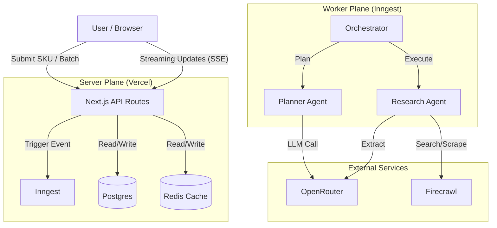

# Target System Architecture

## 1. High-Level Stack

| Component | Technology | Rationale |
| :--- | :--- | :--- |
| **Frontend** | Next.js 14+ (React) | Server Components, API Routes, easy deployment. |
| **Orchestration** | Inngest | Durable execution, retries, step functions, serverless-friendly. |
| **Database** | Postgres (Neon/Supabase) | Structured data, relational queries, vector ready. |
| **Queue/Workers** | Inngest (via HTTP) | Handles long-running "Deep Research" jobs without timeout. |
| **Search Engine** | Firecrawl | Specialized for extracting clean markdown/JSON from web. |
| **LLM Gateway** | OpenRouter | Access to best models (Gemini 1.5 Pro, Sonar, GPT-4o) with failover. |
| **Cache** | Redis (Upstash) | Rate limiting, shared state, dedup locks. |

## 2. Component Diagram

## 3. Data Flow (The "Deep Research" Loop)

1.  **Initiation:** User submits input -> Saved to DB (`Job` table) -> Inngest Event sent.
2.  **Planning:** Inngest function `research-planner` runs. Calls LLM to decide: "Is this a SKU? What attributes do I need?". Output: `ResearchPlan`.
3.  **Execution (Fan-out):**
    - Step 1: `firecrawl_search` (Search for SKU + "specs", SKU + "packaging").
    - Step 2: `firecrawl_extract` (Visit top 3 URLs, extract JSON).
    - Step 3: `normalization` (Standardize units, translate text).
4.  **Synthesis:**
    - Aggregates all extracted JSONs.
    - Runs "Conflict Resolution" logic (weighted voting based on Source Tier).
    - Updates DB with `ConsumableData`.
5.  **Completion:**
    - Status updated to `COMPLETED` or `NEEDS_REVIEW`.
    - SSE push to frontend to notify "Done".

## 4. Key Primitives

- **Sources:**
    - **Tier A (OEM):** hp.com, kyocera.ru (Authority).
    - **Tier B (Retail):** nix.ru, dns-shop.ru (High Trust).
    - **Tier C (General):** Random e-commerce (Verification only).

- **Conflict Resolution Strategy:**
    - If Tier A present: Win.
    - If Consensus (Tier B + Tier B): Win.
    - Else: Flag for review.
