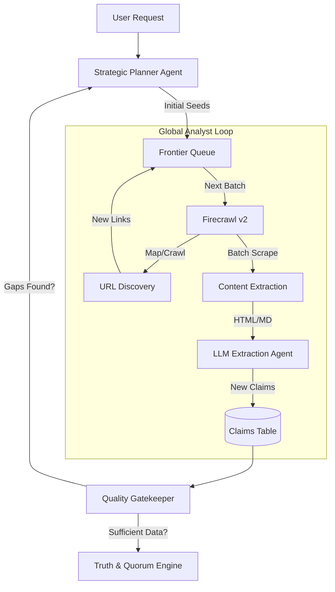

# D² System Architecture (v2.7)

## 1. Core Philosophy: Evidence-First
D² is built on a "Zero Trust" data model. Every piece of data (e.g., "Weight: 1.2kg") is treated as a **Claim**, not a fact.
- **Claim**: A value + Source URL + Confidence Score.
- **Fact**: A resolved value derived from multiple claims via the "Truth & Quorum" engine.

## 2. High-Level Stack

| Component | Technology | Role |
| :--- | :--- | :--- |
| **Frontend** | React, Tailwind, Zustand | Real-time streaming UI, "Thinking" blocks. |
| **API** | Next.js 14+ (Serverless) | Lightweight handlers, SSE stream endpoints. |
| **Orchestrator** | Inngest | Durable execution, "Global Analyst" loops, retries. |
| **Search/Crawl** | **Firecrawl v2** | Deep recursive crawling, batch scraping, map. |
| **Intelligence** | OpenRouter (Gemini/Sonar) | Multi-model reasoning (Router -> Planner -> Extractor). |
| **Storage** | Neon (PostgreSQL) | Relational + JSONB for claims/evidence. |

## 3. The "Frontier" Engine
The core discovery logic is a **Graph Traversal Loop** managed by Inngest.



## 4. Agent Swarm

### 🧠 Discovery Agent (The Strategist)
- **Role**: Plans the research path.
- **Capabilities**: Understands "Knowledge Gaps". Decides between `search`, `crawl`, or `deep_crawl` based on site authority.
- **Tools**: Firecrawl `/search`, `/map`.

### ⚡ Enrichment Agent (The Extractor)
- **Role**: Extracts precise schema-compliant data from pages.
- **Capabilities**: Schema generation on-the-fly.
- **Tools**: Firecrawl `/scrape`, `/batchScrape`.

### 🚚 Logistics Agent (Specialist)
- **Role**: Targeted extraction from logistics partners (e.g., NIX.ru).
- **Capabilities**: Known verification of dimensional data.

## 5. Truth & Quorum Resolution
The system does not just "pick the last value". It invokes an arbitration layer:
1.  **Authority Check**: Is the source OEM (Tier A)? -> **Auto-Win**.
2.  **Consensus Check**: Do 2+ Tier B sources agree? -> **Quorum Win**.
3.  **Conflict**: Disagreement between similar trusted sources? -> **Flag for Human Review**.

## 6. Data Model (Evidence-First)
```typescript
interface EnrichedItem {
  identity: {
    mpn: string; // "CF226A"
  };
  attributes: {
    weight: {
      value: "0.8kg";
      source_id: "url_xyz"; // Link to Evidence
      confidence: 0.95;
    }[]; // Array of Claims
  };
  meta: {
    verification_status: "verified" | "needs_review";
  }
}
```
